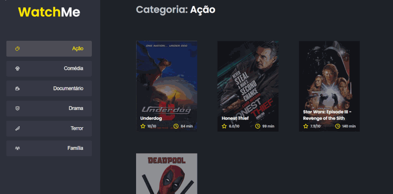

## :rocket: WatchMe 

<div align="center">
  
</div>

## :dart: project purpose

- The application has only one main feature which is the movie listing;
- In the sidebar it is possible to select which category of movies should be listed;
- The first category in the list (which is "Action") must already start as marked;
- The application header only has the name of the required category that should change dynamically.

## :wrench: Installation and use

```bash
# Open a terminal and copy this repository with the command
git clone https://github.com/evertonvargas/watchme
# or use the download option.

# Enter folder 
cd watchme

# Install dependencies
npm i

# Start Fake API
npm run server

# Start application
npm run dev

# Go to http://localhost:8080 in your browser
```